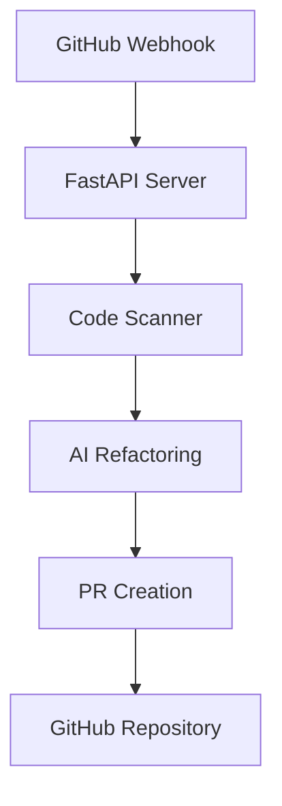

# Architecture

## System Overview

AI Refactoring Bot is designed as a GitHub App that automatically analyzes Python repositories and suggests improvements. The system consists of several key components:

## Core Components

### 1. GitHub Integration (`core/github_pr.py`)
- Handles GitHub App authentication
- Manages repository access
- Creates and manages pull requests
- Uses JWT for secure authentication

### 2. Code Scanner (`core/code_scanner.py`)
- Analyzes Python files using Radon and Flake8
- Identifies code quality issues
- Generates complexity metrics
- Tracks maintainability scores

### 3. AI Refactoring (`core/gpt_refactor.py`)
- Integrates with OpenAI's GPT models
- Generates refactoring suggestions
- Maintains code context
- Ensures suggested changes are safe

### 4. Integrated Scanner (`core/integrated_scanner.py`)
- Coordinates between components
- Manages the scanning workflow
- Handles error cases
- Maintains scanning state

## API Layer (`api/main.py`)

The FastAPI application provides:
- Webhook endpoint for GitHub events
- Health check endpoint
- Installation handling
- Event processing

## Data Flow

1. **Trigger**:
   - GitHub webhook receives repository events
   - Installation events trigger initial scan
   - PR merge events trigger new scans

2. **Analysis**:
   - Code scanner fetches repository content
   - Analyzes Python files
   - Identifies improvement opportunities

3. **Refactoring**:
   - AI model generates suggestions
   - Changes are validated
   - PR is created with improvements

4. **Feedback Loop**:
   - PR reviews and merges
   - New scans triggered
   - Continuous improvement cycle

## Security Considerations

1. **Authentication**:
   - GitHub App JWT authentication
   - Installation access tokens
   - Secure key storage

2. **Authorization**:
   - Repository access control
   - Installation permissions
   - API rate limiting

3. **Data Protection**:
   - Secure environment variables
   - Private key handling
   - API key management

## Configuration

The system is configured through:
- `.env` file for environment variables
- `.refactorai.yml` for repository settings
- GitHub App settings
- OpenAI API configuration

## Error Handling

1. **Retry Mechanisms**:
   - API call retries
   - Rate limit handling
   - Connection recovery

2. **Logging**:
   - Structured logging
   - Error tracking
   - Performance monitoring

## Future Considerations

1. **Scalability**:
   - Async processing
   - Worker queues
   - Caching strategies

2. **Extensibility**:
   - Plugin system
   - Custom analyzers
   - Additional AI models

3. **Monitoring**:
   - Performance metrics
   - Usage statistics
   - Error tracking
